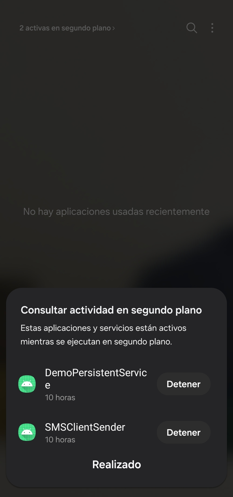

# DemoPersistentService (V2.0.1)

## Introduction

This library expose all necessary to make a persistent service, useful to make a long time process execution. This kind of service
are [foreground services](https://developer.android.com/develop/background-work/services/foreground-services?hl=es-419).

## [Requirements:](https://github.com/AguilasBuildingCode/DemoPersistentService/blob/main/app/src/main/AndroidManifest.xml)

```
<!--AndroidManifest.xml-->
<uses-permission android:name="android.permission.POST_NOTIFICATIONS" />
<uses-permission android:name="android.permission.FOREGROUND_SERVICE" />
<uses-permission android:name="android.permission.FOREGROUND_SERVICE_SPECIAL_USE" />

<!--Application who handle NotificationChannel-->
<application
    android:name="YOUR_APPLICATION"
    [...]>
    <!--Activity who handle the persistent service-->
    <activity
            [...]
            android:name="YOUR_ACTIVITY"
            android:excludeFromRecents="true"
            android:exported="true"
            android:launchMode="singleTask"
            android:taskAffinity="YOUR_APPLICATION_ID">
            [...]
    </activity>
        <!--Service who estend of PersistentService-->
        <service
            android:name="YOUR_SERVICE"
            android:foregroundServiceType="specialUse"
            android:stopWithTask="false" />
</application>
```

## What do you need to start?

### Application who extend of [PersistentServiceApplication](https://github.com/AguilasBuildingCode/DemoPersistentService/blob/main/PersistentService/src/main/java/com/apisap/persistentservice/PersistentServiceApplication.kt) (see a [demo](https://github.com/AguilasBuildingCode/DemoPersistentService/blob/main/app/src/main/java/com/apisap/demopersistentservice/DemoServiceApplication.kt))
This Application provide the notification channel information, required to [post notifications](https://developer.android.com/develop/ui/views/notifications/notification-permission?hl=es-419) from [API Level 26](https://developer.android.com/tools/releases/platforms?hl=es-419#8.0) or higher, and 
the notifications are required to make **Your Persistent Service** be persistent (*foreground*) from [API Level 28](https://developer.android.com/tools/releases/platforms?hl=es-419#9.0) or higher 
for foreground or from [API Level 33](https://developer.android.com/tools/releases/platforms?hl=es-419#13) or higher for foreground
with special use.

### Service who extend of [PersistentService](https://github.com/AguilasBuildingCode/DemoPersistentService/blob/main/PersistentService/src/main/java/com/apisap/persistentservice/services/PersistentService.kt) (see a [demo](https://github.com/AguilasBuildingCode/DemoPersistentService/blob/main/app/src/main/java/com/apisap/demopersistentservice/services/DemoPersistentService.kt))
This new service only provide the necessary to make it persistent, only override the required and add your own logic.

### Activity who extend of [PersistentServiceActivity](https://github.com/AguilasBuildingCode/DemoPersistentService/blob/main/PersistentService/src/main/java/com/apisap/persistentservice/activities/PersistentServiceActivity.kt) (see a [demo](https://github.com/AguilasBuildingCode/DemoPersistentService/blob/main/app/src/main/java/com/apisap/demopersistentservice/DemoPersistentServiceActivity.kt))
This Activity provide an instance of [PersistentServerPermissions](https://github.com/AguilasBuildingCode/DemoPersistentService/blob/main/PersistentService/src/main/java/com/apisap/persistentservice/permissions/PersistentServerPermissions.kt), help to handle service [ServiceConnection](https://github.com/AguilasBuildingCode/DemoPersistentService/blob/main/PersistentService/src/main/java/com/apisap/persistentservice/services/PersistentServiceConnection.kt), 
start, bind, unbind and/or stop your service automatically if your service is already running, also give you the 
functions to start or stop your service by own criteria.

| Method                                    | Functionality                                                    | Do automatically |
|-------------------------------------------|------------------------------------------------------------------|------------------|
| startPersistentServiceForegroundAndUnbind | Start the service in foreground mode and unbind at onStop cycle. | Yes              |
| startPersistentServiceAndBind             | Start the service without foreground and bind at onStart cycle.  | Yes              |
| stopPersistentServiceAndUnbind            | Stop and unbind service (use by own criteria).                   | No               |

Also, this activity request permissions automatically at __*onStart*__ cycle.

#### How to add new Permissions?
If you need to add new permissions and request they at same time, you can extend of [PersistentServerPermissions](https://github.com/AguilasBuildingCode/DemoPersistentService/blob/main/PersistentService/src/main/java/com/apisap/persistentservice/permissions/PersistentServerPermissions.kt) and 
add yours new permissions in __*init*__ with __*addPermissions*__ method. Remember change type in your activity that extend of [PersistentServiceActivity](https://github.com/AguilasBuildingCode/DemoPersistentService/blob/main/PersistentService/src/main/java/com/apisap/persistentservice/activities/PersistentServiceActivity.kt)
from [PersistentServerPermissions](https://github.com/AguilasBuildingCode/DemoPersistentService/blob/main/PersistentService/src/main/java/com/apisap/persistentservice/permissions/PersistentServerPermissions.kt) to your new class.


*Note: add the new permissions in your Manifest.

# Simplify you project
The main set of this project is make the foreground service more easy and clear, focusing on the service logic.

## Disclaimer
The services in Android like others components are made to die, if you want to make your service endless, you should follow 
the next tricks:

If you're looking for automate process like send SMS, make Calls, and others, you can remove and disable all applications that 
you can in the device, keep only the necessary like a browser and application store.

Always kills all application on the task manager, don't take care, your service going to be okay.

### Why?
Android OS kills your service when it needs the memory to execute others services or applications in foreground, if your device 
don't has applications you memory always are free.


If you want to make an application for end users and you're looking for endless service, this library isn't for you. With regular
use, the service is killed by OS. However, the system usually up again the service, it's depend of Android version, vendor and others facts.

You can use this library in end users project, but, handle your business logic very well, usually when the system kills your service, it 
doesn't call __*onDestroy*__ cycle, and when your service get up again, it restart the lifecycle. Be careful.

# Demo




# Device ref
Samsung Galaxy M13
Model: SM-M135M/DS


# Install by JitPack
[](https://jitpack.io/#AguilasBuildingCode/DemoPersistentService/2.0.1)

# Install by binary
[V2.0.1](https://github.com/AguilasBuildingCode/DemoPersistentService/releases/tag/2.0.1)